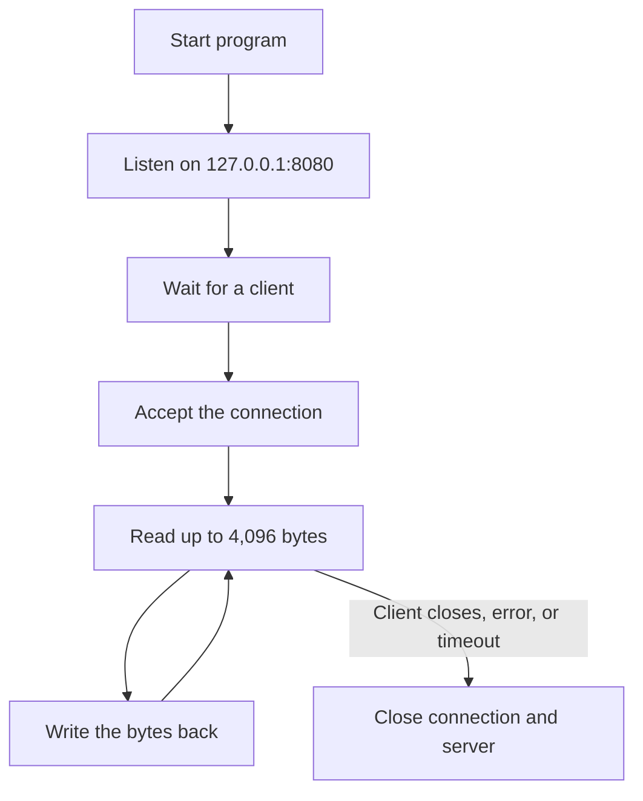

# 2026-08-11 to 2026-08-19

## What I studied

* Go fundamentals and syntax
* Processes and how operating systems manage them
* Basic TCP networking

## What I built

I built a basic TCP echo server in Go.

### Current architecture

* The server listens on `127.0.0.1:8080`.
* It waits for and accepts one client connection.
* It reads up to 4,096 bytes at a time from the client.
* It sends the received bytes back to the client.
* It continues reading and echoing data until the client closes the connection or a read error or timeout occurs.
* After the connection ends, the server shuts down.

Version: [`v1.0.0`](https://github.com/HienXuanPham/tcp-server/blob/36f7cf19bee8bf37059cc51d38a3b392a35cbf8c/main.go)

## What I can explain now

### Program vs Process

* A program is a file containing instructions and data stored on a computer.
* A process is a running instance of a program. It is created and managed by the operating system.
* The CPU executes the program’s instructions.

### Example: How the OS starts a program

* The music player program is stored on disk.
* When a user opens it by double-clicking its icon, the operating system creates a process.
* The OS loads the program’s instructions and data into RAM.
* It allocates memory and other resources to the process.
* It schedules the process to use the CPU.
* The CPU executes the program’s instructions.
* The process can respond to user actions, such as selecting and playing a song.

### What happens when the TCP server starts?

* The program asks the operating system to create a TCP socket.
* The socket is bound to the IP address `127.0.0.1` and port `8080`.
* The socket begins listening for incoming client connection requests.
* When a client connects, the server accepts the connection and receives a new socket that it uses to communicate with that client.

## Bugs I encountered

### [TCP server repeatedly writes the same bytes](https://github.com/HienXuanPham/tcp-server/commit/e2e39460c29edeadc1dfed89fa187313e4a2d9e2#diff-2873f79a86c0d8b3335cd7731b0ecf7dd4301eb19a82ef7a1cba7589b5252261L78)

**Problem:** A call to `Write()` may write fewer bytes than requested. In my loop, I kept passing the same original slice into `Write()`, so the same data got written again and again.

**Fix:** After each call to `Write()`, I move the slice forward by the number of bytes that were actually written. This way, the next write only sends the remaining bytes.

**What I learned:** In networking, you can’t assume a single `Write()` call will send everything. You always need to check how many bytes were written and keep writing until the full message is sent or an error happens.
